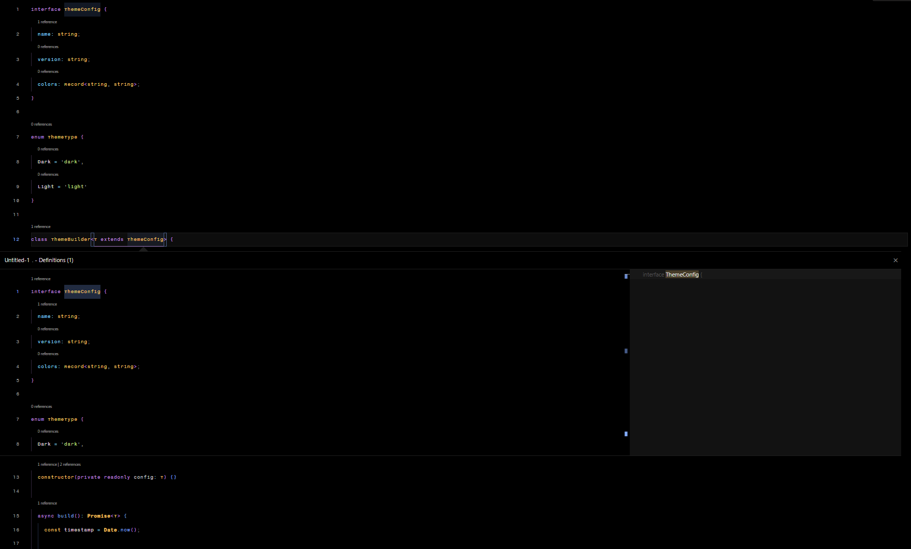
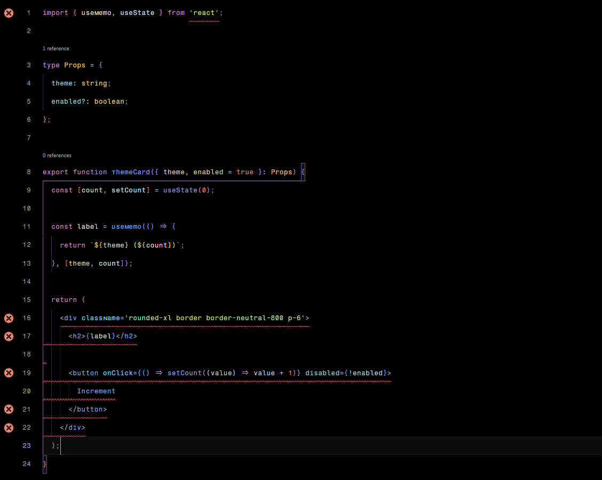
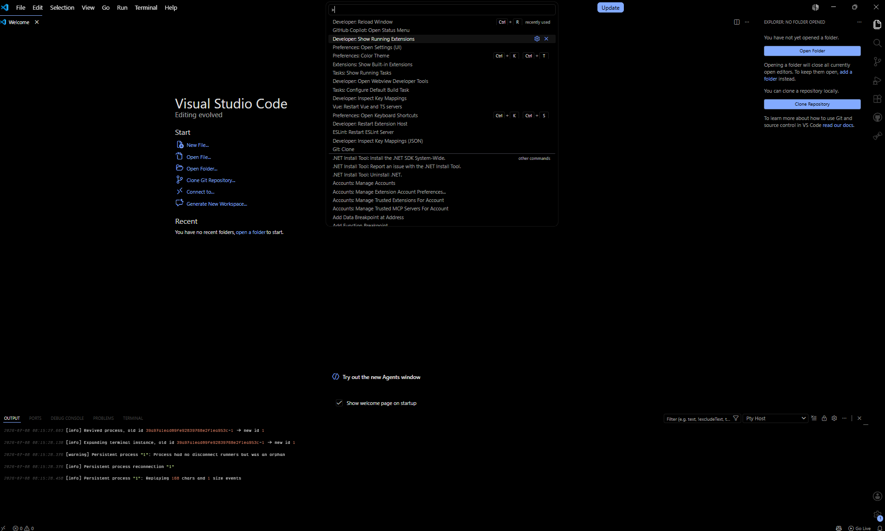

# Stylta Flow Dark

A new premium true-black Visual Studio Code theme built for developers who value clarity, consistency, and focus.

Stylta Flow Dark combines a minimal black workspace with carefully selected accent colors to create a modern coding experience that remains comfortable during extended development sessions.

---

## Features

### True Black Interface

Unlike traditional dark themes, Stylta Flow Dark embraces a pure black foundation.

- Pure black editor background
- Distraction-free workspace
- Reduced visual noise
- Improved contrast and readability

### Carefully Crafted Color System

| Purpose             | Color            |
| ------------------- | ---------------- |
| Keywords            | Purple (#C792EA) |
| Functions & Methods | Blue (#82AAFF)   |
| Properties          | Cyan (#89DDFF)   |
| Strings             | Green (#C3E88D)  |
| Types & Classes     | Yellow (#FFCB6B) |
| Numbers & Literals  | Orange (#F78C6C) |
| Errors              | Red (#FF5370)    |

### Semantic Highlighting

Stylta Flow Dark includes semantic token support for:

- TypeScript
- JavaScript
- React
- TSX
- Python
- Rust
- SQL
- HTML
- CSS
- JSON
- YAML
- TOML

### Optimized Workbench

Custom styling includes:

- Activity Bar
- Side Bar
- Command Center
- Peek Views
- Notifications
- Sticky Scroll
- Terminal
- Suggest Widget
- Quick Pick
- Command Palette
- Status Bar
- Problems Panel
- Merge Editor
- Diff Editor

### Enhanced Git Experience

Custom colors for:

- Added changes
- Modified changes
- Deleted changes
- Merge conflicts
- Source control decorations
- Overview ruler indicators

### Markdown Support

Specialized highlighting for:

- Headings
- Links
- Quotes
- Lists
- Inline code
- Code blocks

---

# Screenshots

### TypeScript



### React / TSX



### WelcomePage



---

## Philosophy

Stylta Flow Dark follows a simple design principle:

> Every color should convey meaning.

Instead of using color for decoration, each accent color serves a purpose across the entire editor experience.

---

## Development Setup

Want to contribute or customize the theme?

Clone the repository and install the dependencies:

```bash
git clone <repository-url>
cd stylta-flow-dark
npm install
```

Start the development watcher:

```bash
npm run dev
```

This starts the TypeScript build process that continuously generates the final VS Code theme JSON file whenever changes are made.

### Previewing Changes

1. Keep the development watcher running.
2. Press **F5** inside VS Code.
3. A new **Extension Development Host** window will open.
4. Select **Stylta Flow Dark** as the active theme.
5. Make changes and observe them live in the development window.

This workflow allows you to rapidly iterate on:

- Theme colors
- Semantic token colors
- TextMate token scopes
- Workbench styling
- Editor UI customization

---

## Contributing

Contributions are always welcome.

While considerable effort has gone into covering a wide range of languages and workbench components, there may still be areas that could benefit from improved styling, missing scopes, or additional language support.

If you notice something that looks out of place:

- Open an issue
- Submit a pull request
- Suggest improvements
- Report missing token scopes
- Propose language-specific enhancements
- Improve documentation

### Pull Requests Welcome

Pull requests of all sizes are appreciated.

Whether you're fixing a small color inconsistency, improving semantic highlighting, adding support for additional languages, or refining workbench colors, your contribution is valuable and appreciated.

The goal is to make Stylta Flow Dark as polished and complete as possible for every developer who uses it.

---

## Recommended Settings

```json
{
  "editor.semanticHighlighting.enabled": true,
  "editor.stickyScroll.enabled": true,
  "editor.guides.bracketPairs": true,
  "editor.guides.indentation": true,
  "editor.fontFamily": "Victor Mono",
  "editor.fontLigatures": "'ss01','ss04','ss08','ss06','calt'"
}
```

---

## Enjoy Stylta Flow Dark

Thank you for using Stylta Flow Dark.

Feedback, suggestions, bug reports, and pull requests are always appreciated.
